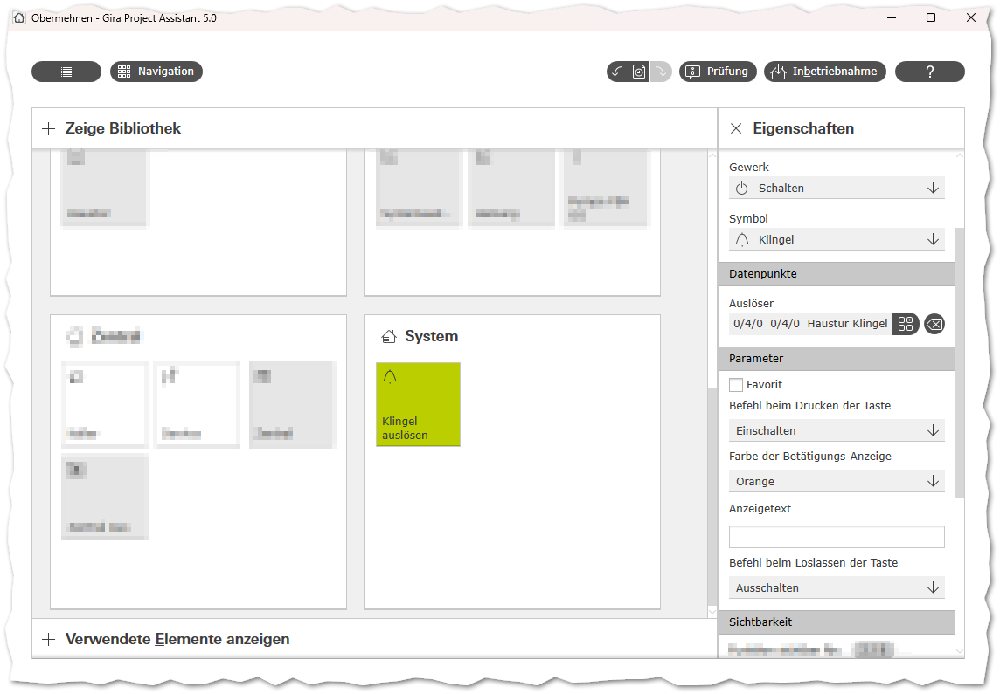
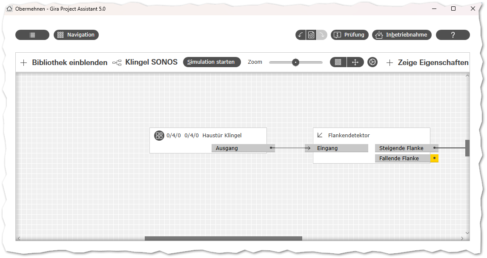
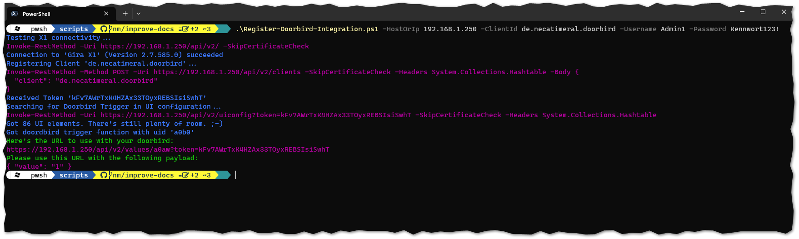
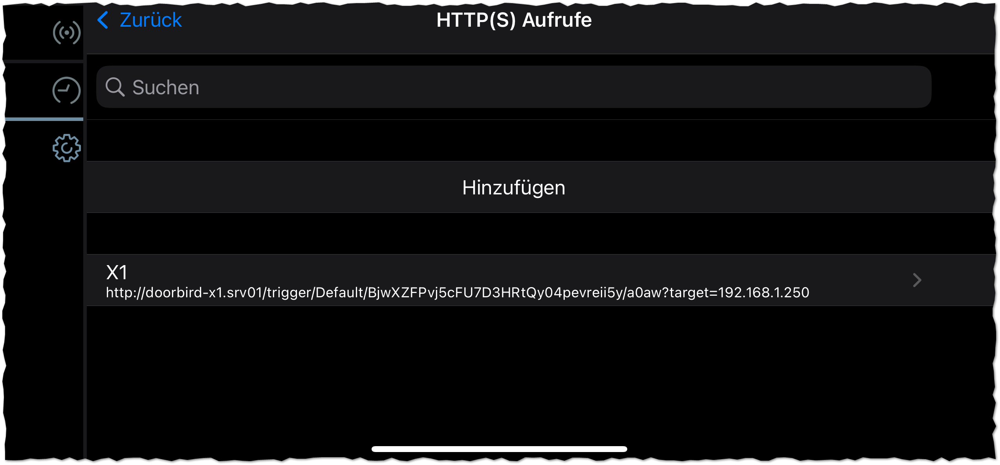

# Doorbird X1 Listener-Setup

Diese Anleitung beschreibt das Setup für den Doorbird X1 Listener im Gira X1 und der Doorbird-Anlage.

> Es wird ein grundlegendes Verständnis von Docker und Web-Requests vorausgesetzt. Die hier dargestellten Zugänge wurden nach der Erstellung dieser Anleitung entfernt.

## 1. Doorbird X1 Listener

Zur Installation kann folgende `docker-compose.yml` genutzt werden.
Für die weitere Installation muss der Hostname oder die IP des Docker-Hosts notiert werden.

```yml
version: "3"

services:
  listener:
    image: ghcr.io/necatimeral/doorbird-x1-listener:main
    ports:
    - "65401:80"
    environment:
      TZ: 'Europe/Berlin'
      # Doorbirds__Default__HostOrIp: '192.168.1.250' # Optional: Fixiert die IP für Trigger-Anfragen, wenn gewünscht
```

## 2. IOT-Trigger erstellen

Damit der Listener die X1 IOT API nutzen kann, muss dieser zunächst als Client im X1 registriert werden.

In der Visualisierung des X1 muss ein Element vom Typen `Taster (Drücken/Loslassen)` mit dem Titel `Klingel auslösen` definiert werden.
Dieses Element muss an einen Datenpunkt vom Typ `1-Bit` gebunden werden (KNX-Integration optional). Dieses Element kann für alle Benutzer unsichtbar geschaltet werden, dies dient lediglich als nutzbarer Trigger in der API.



Die hier gewählte Variable oder der Datenpunkt kann nun als Eingang in einem Logikblatt genutzt werden. Es ist ratsam dieses Logikblatt bereits jetzt anzulegen, da vor dem nächsten Schritt eine Inbetriebnahme erfolgen muss.



> Wichtig: Der GPA muss nun in Betrieb genommen werden.

## 3. IOT-Client registrieren



Zur Registrierung kann das Script `scripts/Register-Doorbird-Integration.ps1` genutzt werden. Hier müssen folgende Parameter angegeben werden:

| Parameter             | Standardwert       | Beschreibung
|-----------------------|--------------------|-------------------------------------
| `HostOrIp`            | (leer)             | Die IP-Adresse oder DNS-Name des X1
| `ClientId`            | (leer)             | Eine ID für den zu registrierenden Client
| `Username`            | (leer)             | Ein Administratorkonto im X1
| `Password`            | (leer)             | Das Kennwort des angegebenen Kontos
| `DoorbirdTriggerName` | `Klingel auslösen` | (optional) Gibt den Namen des Klingel-Trigger-Elements im GPA an

Das Script versucht nun den gewünschten Client im X1 zu registrieren und gibt den Token aus.
Zusätzlich zum Token wird auch die erforderliche `uid` des Trigger-Elements ausgegeben (wenn gefunden).

Für die weitere Einrichtung werden die folgenden Ausgabewerte benötigt:
* `Received Token '<token>'`
* `Got doordbird trigger function with uid '<uid>'`

## 4. HTTP-Aufruf aus Doorbird

In der Doorbird-App muss nun der HTTP-Aufruf an den eingetragen werden.
Abhängig von der eigenen Umgebung kann dies so aussehen:



Anschließend muss noch der `Zeitplan für Türklingel` für den HTTP-Aufruf hinterlegt werden:


